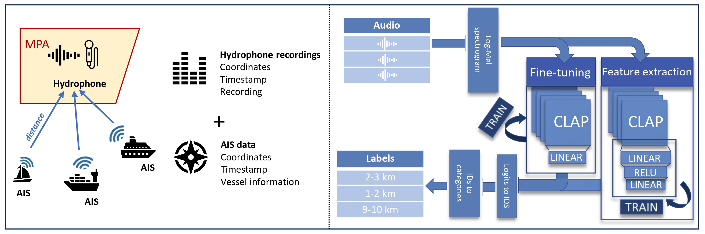

 [](https://doi.org/10.5281/zenodo.18486404)
 # Vessel Distance Classification with CLAP
## Overview

This repository contains the implementation of a convolutional neural network (CNN) model for vessel distance classification using underwater acoustic data. The model is based on the Contrastive Language-Audio Pretraining (CLAP) framework and is designed for transfer learning to predict the distance of vessels from hydrophones deployed in the Belgian part of the North Sea (BPNS).

The dataset used in this project consists of synchronized acoustic and AIS (Automatic Identification System) data, allowing for supervised classification based on vessel presence and proximity. The model is described in:

**Paper**
Decrop Wout, Deneudt Klaas, Parcerisas Clea, Schall Elena, Debusschere Elisabeth, 2025. Transfer learning for distance classification of marine vessels using underwater sound. https://ieeexplore.ieee.org/document/11105453

**Dataset**
AIS-annotated Hydrophone Recordings for Vessel Classification: https://doi.org/10.14284/723

---

## Folder Structure

```
├── 1_Data_Split              # Train/test/validation split information
├── 2_1_Data                  # Contains dataset text files with .wav file locations
├── 2_2_Model                 # Model training and testing scripts
├── 3_1_Results               # Stores model outputs and predictions
├── 3_2_Check_Performance     # Performance evaluation scripts and metrics
├── 3_3_figures               # Plots and visualizations
├── 4_Export                  # Exported model weights and configurations
├── __pycache__               # Cached Python files
├── config.yaml               # Configuration file for running experiments
├── requirements.txt          # Required dependencies
├── README.md                 # This file
```

---

## Overview
### Data Preparation
To prepare the data for distance classification, underwater audio recordings were segmented into 10-second, non-overlapping windows.  
Each segment was annotated using AIS-derived vessel information and categorized based on its proximity to the nearest vessel.

The full data preparation and annotation pipeline — including AIS processing, distance calculation, closest-vessel detection, and audio snippet extraction — is implemented in the following repository:

🔗 **Vessel Acoustic Recording Annotator**  
https://github.com/woutdecrop/Vessel_Acoustic_Recording_Annotator

Distance categories were defined using 1 km bins based on the computed distance between the hydrophone and the closest vessel.

### Model Approaches
The project leverages the **Contrastive Language-Audio Pretraining (CLAP-LAION)** model, which is built upon the original CLAP architecture. The pre-trained CLAP-LAION model named **Biolingual**, partly trained on underwater bioacoustic data, was used for transfer learning following two approaches:

1. **Feature Extraction**  
   - High-level features were extracted from Log-Mel spectrograms using the pre-trained layers.  
   - Extracted features were passed through three custom layers for classification.  
   - Computationally efficient, requiring adjustment only to the final layers.

2. **Fine-Tuning**  
   - Pre-trained weights were used for initialization, but the entire model was retrained.  
   - Followed by a single linear layer for distance classification.  
   - Expected to achieve slightly better performance due to retraining all layers but is significantly more computationally demanding.  

This trade-off between computational efficiency and performance is important when selecting the approach. Feature extraction allows fast adaptation with limited resources, while fine-tuning can maximize predictive accuracy at higher computational cost.

  <!-- Replace with your actual image path -->


### Model weights

The model weights can be found here https://zenodo.org/uploads/16753877 and are available upon request to my email: wout.decrop@vliz.be


## Model Input & Output (I/O)

The Audio Vessel Classifier can accept two types of input:

1. **Raw 10-second audio files**  
   - Users can upload a `.wav` file containing 10 seconds of underwater audio.  
   - The model will process the audio, extract Log-Mel spectrograms, generate embeddings (if using the feature extraction approach), and predict the distance category.  

2. **Pre-computed CLAP embeddings**  
   - Users who already have embeddings extracted from the CLAP-LAION model can upload these directly.  
   - This option skips the feature extraction step and allows faster inference for users with pre-processed data.

### Input Format
- **Audio file**: `.wav`, 10 seconds long, mono channel recommended.  
- **Embedding**: 1D or 2D numpy array or tensor, matching the output dimensions of the pre-trained CLAP-LAION embedding layer.

### Output Format
The model outputs a **distance category** corresponding to the proximity of the nearest vessel:
- 0-1 km
- 1-2 km
- 2-3 km
- 3-4 km
- 4-5 km
- 5-6 km
- 6-7 km
- 7-8 km
- 8-9 km
- 9-10 km
- 10+ km


## Model Training

The core training function is `train_fn`, which is responsible for handling the training process and hyperparameter tuning.

```python
def train_fn(config, checkpoint_dir=None):
    # Extract hyperparameters from the config passed by Ray Tune
    param_a = str(config["param_a"])
    param_b = str(config["param_b"])
    batch_size = config["batch_size"]
    epochs = config["epochs"]
    learning_rate = config["learning_rate"]
    L2 = config["L2"]
    
    # Initialize the model with the given parameters
    L = CLAP_Vessel_Distance(config, batch_size=batch_size, epochs=epochs, lr=learning_rate,
                             freeze_clap=True, save_model=True, L2=L2)
    
    # Train the model with the specified parameters
    L.train_CLAP(param_a=param_a, param_b=param_b)
```

### Explanation:
- `param_a` and `param_b`: Custom parameters used for training variations.
- `batch_size`: Defines the number of samples per training batch.
- `epochs`: Number of training iterations.
- `learning_rate`: Defines the step size for optimization.
- `L2`: If `True`, the model uses the L2 loss function; otherwise, it follows standard loss settings.
- `freeze_clap`: Keeps pre-trained CLAP layers frozen during training.
- `save_model`: Saves the trained model when set to `True`.

### Running Training

- **Grid Search for Hyperparameters**
  ```bash
  python clap_trainer.py
  ```
  This performs a grid search to find the optimal hyperparameters.

- **Training with a Fixed Loss Function**
  ```bash
  python clap_test.py
  ```
  This runs the model with a specific loss function setup.

---

## Configuration

The `config.yaml` file contains all hyperparameter settings, including learning rate, batch size, and loss function choices. Modify this file to customize the training setup.

---

## Requirements

Install the required dependencies:
```bash
pip install -r requirements.txt
```

---

## Results & Performance

The trained models are stored in `3_1_Results/`. You can visualize results using scripts in `3_3_figures/` and analyze performance metrics in `3_2_Check_Performance/`.

---

## Citation

If you use this model, please cite:

- W. Decrop, K. Deneudt, C. Parcerisas, E. Schall and E. Debusschere, "Transfer Learning for Distance Classification of Marine Vessels Using Underwater Sound," in IEEE Journal of Selected Topics in Applied Earth Observations and Remote Sensing, vol. 18, pp. 19710-19726, 2025, doi: 10.1109/JSTARS.2025.3593779. 

---

## License

This repository is licensed under [MIT License](LICENSE).
